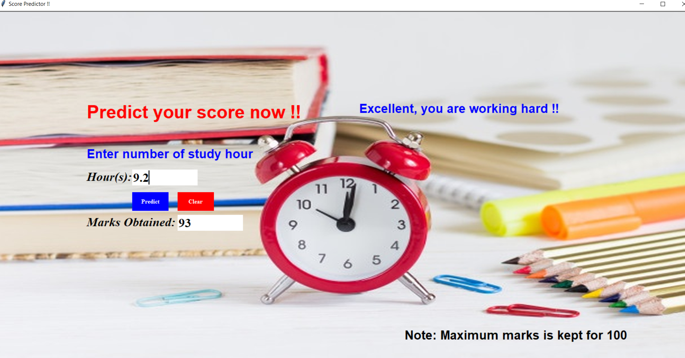
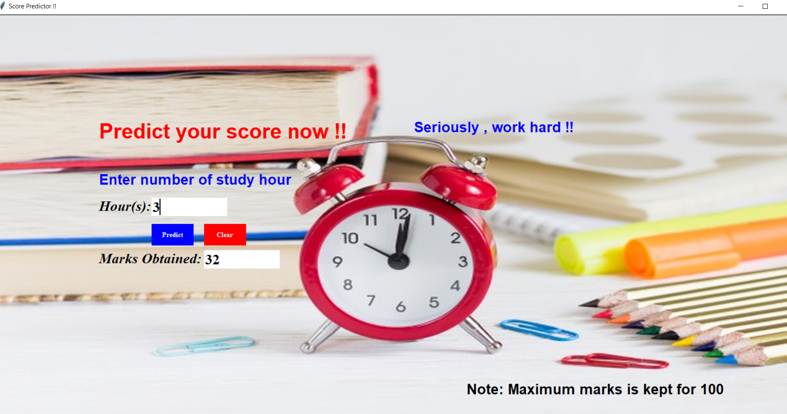

# Explore-Supervised-ML
This repository is part of The Spark foundation Task2: Explore Supervised Learning
GUI application using tkinter is done to predict the score for given input number of hours of study

### Snapshots of the same

## Snapshot 1:

## Snapshot 2:

## Snapshot 3:
